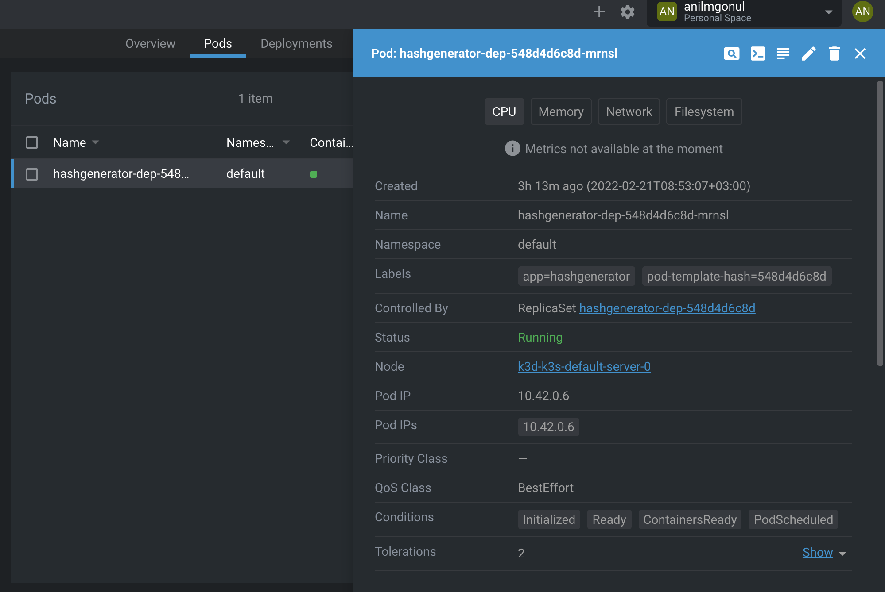

# Kubernetes-Learning
Personal achievement for learning and improving my knowledge with Kubernetes


## What is Kubernetes?

Konteynerlanmis is yukunu ve servisleri yonetmeyi saglayan  otomasyon ve configure etmemize olanak saglayan, acik kaynakli portatif ve gelistirilebilir bir platformdur Kubernetes.

***Traditional deployment era***:Geleneksel aplikasyon dagitim seruveninde fiziksel serverlar kullanilirlirdi. Fiziksel sunucudaki uygulamalar icin kaynar sinirlarini tanimlamanin bir yolu yoktu ve bu durum kaynak tahsil etme sorunlarina neden oluyordu. Ornek verecek olursak, fiziksel bir serverda birden fazla uygulamayi calistiriyorsak, belki de bir uygulama digerlerinden daha fazla kaynak kullanacak ve diger uygulamalar performanslarinin altinda kalacaklar. Her bir uygulamayi farkli serverlarda calistirarak buna cozum getirebiliriz. Ancak bu cozum maliyet ve yuksek performans gerektirdigi icin mantikli olmayacaktir.


***Virtualized deployment era***: Yukaridaki bu durum icin virtualization (sanallastirma) ortaya sunuldu. Bir tane fiziksel server'in CPU'su ile birden vazla sanal makinalarin (VMs) calismasi olanagi kilindi. Ayrica bu virtualization yani sanallastirma diger sanal makinalarin birbirinden izole olmasina olanak sagliyor ve bir uygulamanin diger bir uygulama tarafindan erisim saglamasina izin vermeyerek guvenlik onlemi de aliyor. Bunun yani sira, kolayca maintain yani tamir edilmesi, genel maliyeti dusurmesi, guncellenmesinin kolayligi ve dahasi sanallastirmayi geleneksel metoda nazaran daha cazip kildi.

***Container deployment era***: Konteyner aplikasyon dagitim sistemi ise VMs modeline cok benziyor. Ek olarak bu method, izole ozelliklerini esneklestirerek, uygulamalar arasinda isletim sistemi paylamisina olanak sagliyor. VM'lere benzer olarak konteynerlar kendi filesystem'lari var ve CPU, memory ve isletim sistemini vs palyasirlar.

Konteynerlarin sahip olduklari artilardan bazilari:
- VM'lere kiyasla imaj alimi daha kolaydir.
- Imaj'larin degismezligi sebebiyle guvenilir ve surekli gelisim ve entegrasyon halinde.
- Dev ve Ops is bolumunun endiselerinin ayrilmasinda rol oynar. Mesela derleme ve yayin zamani ile deployment dagitim zamani konulari gibi.
- Yalnizca isletim sistemi duzeyindeki bilgileri veyahut olcumleri degil de uygulama durumunu ve sinyalleri de ortaya cikarir.

Konteynerlar uglulamari calistirmak icin iyi bir secenek. urun/aplikasyon ortaminda uygulamalari calistiran konteynerlari yonetmek gerekir ve herhangi bir kesinti olmadigindan emin olunmasi gerekir. Mesela, bir konteynar cokerse, bir baska konteynerin baslamasi gerekir. **Kubernetes** bu asamada bize bu durumun sistem tarafindan framework ile idare edilmesi sagliyor. Bilgisayar agindaki akista bir sorun oldugunda ya da olceklendirme durumunda deployment dagitim yollari sunarak olayi ele alir.

### Kubernetes Cluster with k3d

Cluster tanimini bir kume olarak dusunursek, calisan makinalae ve nodes'lar bu Kubernetes kumesini olusturur. *kd3* ise herhangi bir teknolojik alette calisabilecek uyumu, hafifligi ve adabtasyonu sunuyor. Bu sebeple orneklerimizi kd3 uzerinden verecegiz.


Ilk cluster'imizi, kumemizi olusturmak icin bir komut yeterli olacaktir.

`$ k3d cluster create -a 2`

Yukaridaki komut bize Kubernetes kumesinin 2 nodu oldugunu gosteriyor. Node ise konteynar olarak algilanabilir.


Olusturdugumuz bu Kubernetes kumesini Docker konteynerlarinda da gorebiliriz `$ docker ps`

```
$ docker ps

CONTAINER ID   IMAGE                      COMMAND                  CREATED         STATUS              PORTS                             NAMES
44a58ff50581   rancher/k3d-proxy:5.3.0    "/bin/sh -c nginx-pr…"   2 minutes ago   Up About a minute   80/tcp, 0.0.0.0:64689->6443/tcp   k3d-k3s-default-serverlb
85252c0acb2e   rancher/k3s:v1.22.6-k3s1   "/bin/k3d-entrypoint…"   2 minutes ago   Up 2 minutes                                          k3d-k3s-default-agent-1
973d87c70ae4   rancher/k3s:v1.22.6-k3s1   "/bin/k3d-entrypoint…"   2 minutes ago   Up 2 minutes                                          k3d-k3s-default-agent-0
1aefdd355f24   rancher/k3s:v1.22.6-k3s1   "/bin/k3d-entrypoint…"   2 minutes ago   Up 2 minutes                                          k3d-k3s-default-server-0
```

Gorulecegi uzere, port numarasi 6443 acik konumda ve "k3d-k3s-default-serverlb" olarak tanimlanmis. Boylece sunucuya baglantimizi bu port uzerinden direkt olarak gerceklestirebiliriz. Makinanin uzerindeki port 64689 ise rastgele secildi.

Clusterlarla interaktif bir sekilde baglanti kurmamizi saglayacak bir baska arac ise **Kubectl**. ***Kubectl*** Kubernetes'in CLI aracidir. k3d ayrica bizim icin Kubectl konfigurasyonunu da yapti ve kullanmaya hazir.

Simdi ise kubectl ile cluster'a , kumeye eriselim. `$ kubectl cluster-info`


Bu durum icin gecerli olmazla beraber, kubectl'in 64689 port ile ***k3d-k3s-default-serverlb*** konterynarina baglandigini gorebiliyoruz.

Eger ki cluster'imizi durudurmak veya baslatmak veyahut silmek istersek `$ k3d cluster stop` ve `$ k3d cluster start` ve `k3d cluster delete` komutlari yeterli olacaktir.


### First Deploy

Ilk mevzilendirmemizi yapalim. `$ kubectl create deployment <konteyner_ismi> --image=<imajiniz>`


Olusturulan bu objeyle beraber inceleme altina almamiz gereken iki konu var: ***Deployment resource*** ve ***Pod***.

### What is Pod?

Pod icin Kubernetes’in en kücük bilesenidir demek yanlıs olmayacaktir. Kubernetes Cluster’inizda calısan process’leri temsil etmektedir. Pod’lar Kubernetes Cluster’inizin deploy edilebilir birimlerdir. Bu bakıs acısiyla, Docker’a asina iseniz, en kaba haliyle container’a denk geldigini söyleyebiliriz.


### What is Deployment resource?

Deployment resurce olusturulan deploymentlari , mevzilendirilmeleri gozeten bir yapidir. Kabaca tabir ile Kubernetes'e hangi konteyneri istedigini, nasil calismasi gerektigini ve kac tanesinin calismasi gerektigini soyler.

Deployment'larimizi bu sekilde gorebiliriz:

```
$ kubectl get deployments

NAME                READY   UP-TO-DATE   AVAILABLE   AGE
hashgenerator-dep   1/1     1            1           13m
```

### Declarative configuration with YAML

Daha onceden deployment'imizi olusturmustuk.

`$ kubectl create deployment hashgenerator-dep --image=jakousa/dwk-app1`

Eger dilersek olusturdugumuz bu deployment'i istedigimiz gibi olceklendirebiliriz. Replica sayilarini belirleyebilir ve guncellenmesini saglayabiliriz.

```COMMAND
$ kubectl scale deployment/hashgenerator-dep --replicas=4

$ kubectl set image deployment/hashgenerator-dep dwk-app1=jakousa/dwk-app1:b7fc18de2376da80ff0cfc72cf581a9f94d10e64
```

Deklare ederken, duzenlenme seklini belirleyebiliriz. Bunun orneklerinden bir tanesi ise ilusturulan konteyneri silmek:

```COMMAND
$ kubectl delete deployment hashgenerator-dep
  deployment.apps "hashgenerator-dep" deleted
```

Bu kisimda yeni bir klasor olusturalim `manifests` adinda ve icinde `deployment.yaml` dosyasi bulunsun. Dosyanin icerigi ise asagidaki gibi olsun.

```yaml
apiVersion: apps/v1
kind: Deployment
metadata:
  name: hashgenerator-dep
spec:
  replicas: 1
  selector:
    matchLabels:
      app: hashgenerator
  template:
    metadata:
      labels:
        app: hashgenerator
    spec:
      containers:
        - name: hashgenerator
          image: jakousa/dwk-app1:b7fc18de2376da80ff0cfc72cf581a9f94d10e64
```  

Goruldugu uzere ***docker-compose*** dosyalarina cok benziyor.

* *kind:Deployment* bize iceriginin ne tur olddugunu deklare ediyor.
* *name:hashgenerator-dep* ise metadatanin ismini deklare ediyor.
* *replicas:1* kac tane replica oldugunu deklare ediyor.
* Genel olarak ise ismi olan bir imaj'dan konteynar oldugunu da deklare ediyoruz.

Bu deployment'i uygulamaya sokmak icin ise:

```COMMAND
$ kubectl apply -f manifests/deployment.yaml
  deployment.apps/hashgenerator-dep created
```        


### Introduction to Debugging

Kubernetes "self-healing" dedigimiz kendi kendi onarma ozelligine sahip. Eger pod'larda veyahut konteynerlarda bir seyler ters giderse biz developerlarin is yuku Kubernetes sayesinde azalmis durumda. Mudahele edilmesi gereken yerlerde veyahut con problemleri yasadigimiz zamanlar, muhtemel tum senaryolari teker teker elemine etmek gerekir. Bunu sistematik bir sekilde saglayabilmemeiz icin ise anahtar olgu her seyi sorgulamaktir. Bu sorgulamalari Kubernetes'te `kubectl describe` ve `kubectl logs` komutlarini kullanarak yapabiliriz.

- `kubectl describe` bize kaynak hakkinda hemen hemen her seyi soyler.
- `kubectl logs` ise yazilimda problem olusturan kisimlar hakkkinda bilgi verip, kolay takip etmemizi saglar.


Oncelikle farkli bir yontemle (github'dan cekerek) bir ke daha deployment yapalim:

```COMMAND
$ kubectl apply -f https://raw.githubusercontent.com/kubernetes-hy/material-example/master/app1/manifests/deployment.yaml
  deployment.apps/hashgenerator-dep unchanged
```  

Daha sonrasinda ise **describe** komutumuzu kullanalim:

```COMMAND
$ kubectl describe deployment hashgenerator-dep
```


Buun yani sira, **describe** komutunu daha spesifik olarakta kullanabiliriz. Ornegin, *pod*'lar' hakkinda bilgi almak icin.

`$ kubectl describe pod hashgenerator-dep-548d4d6c8d-mrnsl`


Simdi ise *logs*'larimizi kontrol edebilriz.

`$ kubectl logs hashgenerator-dep-548d4d6c8d-mrnsl`


Son asamada ise [Lens "The Kubernetes IDE"](https://k8slens.dev/) Kubernetes platformunu kullanarak grafik display metoduyla da incelemede bulunabiliriz.





### Introduction to Networking

Biliyoruz ki Kubernetes deploymentlari yonetmek ve otomatik hale getirmekte kullandigimiz acik kaynak platformdur. Bunun yani sira, cluster yani kumemiz icerisinde konteynerlarin bakimini yapabilme, zaman cizelgesini takip etme, ve operasyonu yurutmede olanak sagliyor.

Bunun otesinde, Kubernetes networking , ag yapilari, kubernetes bilesenlerinin kendi aralarinda ve bir baska uygulamayla iletisim haline gecmesine olanak sagliyor. Kubernetes platformu, ana bilgisayar baglantı noktalarini konteynar baglanti noktalarina esleme ihtiyacini ortadan kaldiran duz bir ag yapisina dayandigindan diger ag platformlarindan farklidir.

Bu asamada, basit bir networking uygulamasinin HTTP server'ina baglanmasini gorecegiz. Bir port secilmesi gerekiyor ve port 3000'den default olarak yararlanacagiz.

```COMMAND
$ kubectl apply -f https://raw.githubusercontent.com/kubernetes-hy/material-example/master/app2/manifests/deployment.yaml
  deployment.apps/hashresponse-dep created
```

Bu kisimda, cluster'in disindan baglanmayi deneyecegiz. Olusturdugumuz *hashresponse-dep* pod'unu calistigini ise `port-forward` komutu ile gorebiliriz.

```COMMAND
$ kubectl get pods
NAME                                 READY   STATUS    RESTARTS        AGE
hashgenerator-dep-548d4d6c8d-mrnsl   1/1     Running   1 (2m17s ago)   8h
hashresponse-dep-869df48685-pshdz    1/1     Running   0               46s
```

`$ kubectl port-forward hashresponse-dep-869df48685-pshdz 3003:3000`


Sonrasinda ise, baglantimizi [http://localhost:3003](http://localhost:3003/) adresinden gorebiliriz.

Cluster'imizi docker'in icinde k3d ile calistirdigimiz icin, yapmamiz gereken bir kac hazirlik var. Pod'a cluster'in disindan acilan port yeterli olmayacak, eger cluster'a konteynerin icinden erismek istiyorsak.

Oncelikle konteynerlarimizi gorelim. `$ docker ps`


Isin guzel yani, k3d bizlere API'ye baglanmamiz icin bizlere bir port hazirladi ve bu port 6443 ve ek olarak port 80'e baglanabiliriz. local 8081 to 80 in k3d-k3s-default-serverlb and local 8082 to 30080 in k3d-k3s-default-agent-0 acilmis olacak.

`$ k3d cluster delete`
`$ k3d cluster create --port 8082:30080@agent:0 -p 8081:80@loadbalancer --agents 2`
`$ kubectl apply -f https://raw.githubusercontent.com/kubernetes-hy/material-example/master/app2/manifests/deployment.yaml`


### What is a Service?

Deployment resources dagitim kaynaklariyla ilgilenirken, Service resources uygulamanin disaridan cluster'a baglanma hizmetiyle ilgilenecektir. Bir `service.yaml` dosyasi olusturalim ve asagidaki olusumlari saglamasini inceleyelim:

1. Service istegimizi deklare etmesi
2. hangi porttan dinleme yapacagimizi deklare etmesi
3. Uygulamaya gonderilecek isteklerin nereye yonlendirilecegini deklare etmesi
4. Gonderilen isteklerin hangi port uzerinden gidecegini deklare etmesi

```yaml
apiVersion: v1
kind: Service
metadata:
  name: hashresponse-svc
spec:
  type: NodePort
  selector:
    app: hashresponse # This is the app as declared in the deployment.
  ports:
    - name: http
      nodePort: 30080 # This is the port that is available outside. Value for nodePort can be between 30000-32767
      protocol: TCP
      port: 1234 # This is a port that is available to the cluster, in this case it can be ~ anything
      targetPort: 3000 # This is the target port
```    

```
$ kubectl apply -f manifests/service.yaml
  service/hashresponse-svc created
```

Buradan [http://localhost:8082](http://localhost:8082/) erisim saglayabiliriz.

### What is an Ingress?

Ingress, Kubernetes’de çalıştırdığınız uygulamanın kullanıcılar tarafından erişilmesine izin vererek dış trafiği Kubernetes servislerine bağlar. Bazı diğer bileşenlerin, nesnelerin veya hizmetlerin aksine, ingress controller bir küme başlatıldığında otomatik olarak başlamaz. Doğru ingress controller seçmek için, Kubernetes kümenize gelen trafiği ve yükü göz önünde bulundurarak karar verilmelidir. [Kaynak](https://medium.com/devopsturkiye/kubernetes-ingress-controllers-4b12458a5ba2#:~:text=Ingress%2C%20Kubernetes'de%20%C3%A7al%C4%B1%C5%9Ft%C4%B1rd%C4%B1%C4%9F%C4%B1n%C4%B1z%20uygulaman%C4%B1n,k%C3%BCme%20ba%C5%9Flat%C4%B1ld%C4%B1%C4%9F%C4%B1nda%20otomatik%20olarak%20ba%C5%9Flamaz.)

Ingress'e gecmek icin Ingress resources, kaynaklarini olusturmami gerekir. Ingress, gelen trafigi Service'e yonlendirecektir, fakat daha once `service.yaml` dosyasinda kullandigimiz **NordPort** Service bunu yapmayacaktir. O sebeple:

```COMMAND
$ kubectl delete -f manifests/service.yaml
  service "hashresponse-svc" deleted
```      

ClusterIP turu hizmet kaynagı, Service'e cluster'dan erisilebilen bir InternalIP verir.

Asagidaki service.yaml dosyasi TCP trafigini port 2345'ten port 3000'e yonlendirir.

```yaml
apiVersion: v1
kind: Service
metadata:
  name: hashresponse-svc
spec:
  type: ClusterIP
  selector:
    app: hashresponse
  ports:
    - port: 2345
      protocol: TCP
      targetPort: 3000
```      

Ingress dosyasindan ise beklentimiz:
1. Ingress olmasini deklare etmesi
2. Tum trafigi Service'imize yonlendirmesi

**ingress.yaml**

```yaml
apiVersion: networking.k8s.io/v1
kind: Ingress
metadata:
  name: dwk-material-ingress
spec:
  rules:
  - http:
      paths:
      - path: /
        pathType: Prefix
        backend:
          service:
            name: hashresponse-svc
            port:
              number: 2345
```              

Bu asamada, sonuclari gormek icin her seyi uygulayabiliriz.


### Introduction to Storage

Docker'da da volume, disk bolumunde kullanilan hacim alani, var ancak bir sekilde kolay yonetilebilir degil, cunku belli limitleri var. Docker'da volume diskte veya bir baska konternerda directory olarak mevcut. Bunun yani sira, Kubernetes bir cik farkli volume tiplerini destekliyor. Pod'lar es zamanli olarak birden fazla volume'lara sahip olabilirler. Ancak bilinmesi gereken, pod'lar zarar gorurse, icinde sakladigimiz veriyi kaybederiz. Ek olarak, eger bir pod'u baska bir node'dan cikartirsak/yurutursek, volume'un icerigini kaybederiz. Volume,lara veriyi kaydetmek icin ihtiyacimiz var. Kubernetes'in destekledigi birden fazla volume turleri:

- Local Node Types – emptyDIR, hostpath, local
- File Sharing types – nfs
- Storage types – fc, iscsi
- Special Purpose Types – Secret, Git repo
- Cloud Provider types – Vsphere, Cinder, awsElasticBlockStore,     azureDisk, gcepersistentDisk
- Distributed filesystem types – glusterfs, cephfs
- Special type – persistent volume, persistent volume claim

1. ***emptyDir*** pod calisana kadar veriyi sadece memory'de yazar. Bu da demektir ki, verimiz pod silindiginde veri de gider Yani persistent, kalici degildir.
2. ***hostpath***, ***local***, ***fc*** ise persistent yani kalici turde olanlardir. Sadece local node'larda var olurlar. Diger node'larla iletisim halinde olmasini saglamak icin geleneksel yontemlerle volume paylasimini setup yapmamiz gerekir.
3. Son olarak, ***persistent*** turundeki volume'lar ise node'lar arasinda erisim saglar.  

#### How to use Kubernetes volumes to pod and containers?

Deployment dosyamizda pod'larda calismasi icin opsiyon olarak **Volume**'u isim ve turunu deklare etmemiz gerekiyor. Bunun yani sira, **volumeMounts**'i *mountPath* olarak kullanarak konteynerda nereye birlestirilmesi gerektigini dekralere etmeliyiz. Volume ismi unique, tek olmali ve konteynerda spesifik olarak deklare edilmeli. Aksi takdirde, hata ile karsilasiriz.

```yaml
spec:
volumes:
– name: volume
hostPath:
      path: /mnt/data
containers:
– name: container1-nginx
image: nginx
volumeMounts:
– name: volume
mountPath: “/var/nginx-data”
– name: container2-tomcat
image: tomcat
```

Yukarida goruldugu uzere, volume ismi: "volume", yolu: "/mnt/data" olarak, spesifik deklarasyon: "spec" olarak kullanilacak bu pod'un icerisinde. Birlesecegi yer "“/var/nginx-data”" ve konteynerin adi ise "container1-nginx".


### What is a Namespace?

Kubernete'in uzerinde birden fazla servisler olusturdukca basit gorevler ve aktiviteler dahi kompleks bir hal almakta. Ornegin, yazilim takimlari ayni isimde Kubernetes Service'lerini ve Deployment'lari isimlendiremezler. Binlerce pod'larimizin olacagini dusunursek, bunlari teker teker siralamak ve isimlendirmek hayli vakit alacaktir onlari yonetebilmemiz icin. Bu sadece Iceber'in gorunen kismi. Bu sebepten oturu, Kubernetes Namespace'e ihtiyacimiz ve bu sayade Kubernetes kaynaklarini daha kolay bir sekilde yonetebiliriz.

Namespace'i Kubernetes cluster'inin icinde olusturdugumuz virtual, sanal bir cluster olarak dusunebiliriz. Yani kume icinde olusturulan sanal bir kume. Bu kumeler ise mantiksal bir bicimde birbirlerinden izole edilmislerdir. Bu kumelenme bize ve yazilim takimlarina organizasyon, uygulamanin guvenligi ve performans olarak yardimci olacaktir.

`default` Namespace; genel itibariyle Kubernetes dagitimlarinda default olarak adlandirilan bir cluster'dir. Acikcasi, 3 farkli Namespace'lere sahibiz: `default`, `kube-system`(Kubernetes komponentleri icin kullanilir) ve `kube-public`(public kaynaklar icin kullanilir).

#### Creating Namespace

Namespace olusturmak icin cekinmemize gerek yoktur. Buyuk organizasyonlar goz onune alindiginda, takimlarin deploy ettikleri yazilimlar ile override yapilma olasiligi var ancak, Namespace bize penalti vermez, aksine performans arttici bir unsur olarak gorulur.

Namespace'i olusturmak icin bir satir komut yeterli olacaktir. Simdi ise, "test" adinda bir Namespace olusturalim:

```COMMAND
$ kubectl create namespace test
namespace/test created
```

Bunun yani sira, YAML dosyasi olarakta herhangi bir Kubernetes kaynagi gibi Namespace olusturabiliriz.

```yaml
kind: Namespace
apiVersion: v1
metadata:
  name: test
  labels:
    name: test
kubectl apply -f test.yaml
```  

Bunun yani sira, olusturulan Namespace'leri gormek icin:

`$ kubectl get namespace`


Yukarida goruldugu uzere, system tarafindan olusturulan 3 Namespace'i ve bizim olusturdugumuz Namespace'i gorebiliriz.

#### Creating Resources in the Namespace

Pod olusturmak icin basit bir YAML dosyasini inceleyelim.

```yaml
apiVersion: v1
kind: Pod
metadata:
  name: mypod
  labels:
    name: mypod
spec:
  containers:
  - name: mypod
    image: nginx
```

Yukarida goruldugu uzere, herhangi bir yerde `namespace`'den bahsetmedik. Eger bu dosya icin `kubectl apply` komutunu kullanip calistirirsak, Pod'u su anki aktif namespace'de olusturacaktir ve bu da `default` namespace'i olacaktir degirtirmedigimiz muddetce.

Iki tur yontem vardir hangi Namespace'i olusturacagimizi Kubernetes'e soylemek icin. Ilk olarak `--namespace` etiketini kullanabiliriz.

`$ kubectl apply -f pod.yaml --namespace=test`

Bununla birlikte, YAML dosyasinda da ***spesifik(spec)*** bir sekilde belirtebiliriz.

```yaml
apiVersion: v1
kind: Pod
metadata:
  name: mypod
  namespace: test
  labels:
    name: mypod
spec:
  containers:
  - name: mypod
    image: nginx
```

#### Viewing resouces in the Namespace

Pod'umuzu bulmaya calisalim:

```COMMAND
$ kubectl get pods
No resources found.
```

Goremiyoruz. Bunun sebebi ise, tum komutlar aktif olan Namespacei'e karsi calisir. Pod'umuzu bulabilmek icin, `--namespace` etiketini kullanmaliyiz.


Ilk izlenim, aktif namespace'imizin "default" namespace olarak ortaya cikiyor olmasi. Namespace'imizi YAML dosyasinda spesifik olarak deklare ettigimiz takdirde, butun Kubernetes komutlari aktif olarak o namespace'i kullanacak.

Maalesef ki, aktif Namespace'i `kubectl` ile yonetmek kolay degil. Bu sebepten oturu, kullanabilecegimiz guzel bir tool var : `kubens`. Ek bilgi olarak "kubens" Turk yazilimci [Ahmet Alp Balkan](https://ahmet.im/) tarafindan olusturuldu.

"kubens" komutunu kullandigimizda tum Namespace'leri gorebiliriz ve aktif olarak calisan ise renklendirilmis olarak karsimiza cikar.


Aktif olan Namespace'i degistirmek icin :

`$ kubens test`


Bu asamada, `kubectl` komutunu kullanirsak eger, Namespace'imiz **"default"** yerine **"test"** oldugu icin, *"namespace"* etiketini kullanmadan da test namespace'in icindeki Pod'umuzu gorebiliriz.

```COMMAND
$ kubectl get pods

NAME    READY   STATUS    RESTARTS   AGE
mypod   1/1     Running   0          17m
```

### ConfigMap

ConfigMap Konteyner imaji icindeki konfigurasyon detaylarini aryi olarak tutmaya yarayan bir olgudur. Calisir durumdaki pod'larda ve konteynerlarda degisiklik yapmak icin YAML dosyasini yeniden olusturup tekrardan deoploy etmemiz gerekecek. Bu durumda, ConfigMap bizlere pod uzerinde bir degisiklik yapmadan disaridan istedigimiz degisiklikleri yapmamizi saglar.

Bu asamada, ConfigMap'in nasil uygulandigini gorelim. Oncelikle "webnginx.yaml" adinda bir dosya olusturalim. Amacimiz, 'Merhaba Nginx!' icerikli sayfayi 'Hello World' degeriyle degistirmek. STRING ve PATH veri alanimizi olusturacagimiz pod'lara baglayacagiz. Bunun yani sira `minikube` cluster'ini kullanacagiz.

```yaml
apiVersion: v1
kind: ConfigMap
metadata:
  name: webnginx
  namespace: default
data:
  STRING: Merhaba Nginx!!!
  PATH: /usr/share/nginx/html/index.html
```

`minikube kubectl create -- -f Webnginx.yaml` komutuyla ConfigMap'imizi olusturacagiz.

```COMMAND
$ minikube kubectl create -- -f Webnginx.yaml
configmap/webnginx created
```

Olusturdugumuz ConfigMap'i gormek icin:

```COMMAND
$ minikube kubectl get configmaps
NAME               DATA   AGE
kube-root-ca.crt   1      3m8s
webnginx           2      81s
```


Bunun yani sira, `describe` komutuyla tanimlari da gorebiliriz.

```COMMAND
$ minikube kubectl describe configmap webnginx
Name:         webnginx
Namespace:    default
Labels:       <none>
Annotations:  <none>

Data
====
PATH:
----
/usr/share/nginx/html/index.html
STRING:
----
Merhaba Nginx!!!

BinaryData
====

Events:  <none>

```

Siradaki islem ise, bir pod olusturmak "webapp.yaml" ve icine asagidaki degerleri yazalim.

```yaml
apiVersion: v1
kind: Pod
metadata:
 name: webapp
 labels:
     app: webapp
spec:
   containers:
   - image: nginx
     name: nginx
     ports:
     - containerPort: 80
     command: ["/bin/sh", "-c", "echo $(DATA_STRING) > $(DATA_PATH); sleep 3600"]
     env:
      - name: DATA_STRING
        valueFrom:
           configMapKeyRef:
               name: webnginx
               key: STRING
               optional: true
      - name: DATA_PATH
        valueFrom:
           configMapKeyRef:
               name: webnginx
               key: PATH
               optional: true
```

Yukarida goruldugu uzere, bir adet konteynar iceren bir pod'umuz var ve konteynerin icinde nginx imaj'imiz bulunuyor. **command** kisminda configmap olarak hazirlanan veriler tanimlanmis durumda. **env** kisminda ise tanimlanan verilerin configmap ile iliskisi kuruluyor. **configMapKeyRef** kisminda ise daha onceden olusturulan configmap bilgisi yer aliyor.

Simdi ise pod'umuzu olusturalim:

```command
$ minikube kubectl create -- -f webapp.yaml --validate=false
pod/webapp created
```

Olusturulan bu pod'a CLI ile erisim saglayip configmap icinde belirtilen degerler index.html dosyasina yazilip yazilmadigi kontrol edelim. Pod'umuza erisim saglamak icin `$ minikube kubectl exec webapp — -it /bin/sh` komutunu kullanmamiz gerekiyor. Ardindan configmap icerisinde belirtilen dizinde sayfadaki degisikligi kontrol edelim, `# cat /usr/share/nginx/html/index`


ConfigMap'imiz ile karsilastirmak icin: `$ minikube kubectl describe configmap webnginx`

```command
$ minikube kubectl describe configmap webnginx
Name:         webnginx
Namespace:    default
Labels:       <none>
Annotations:  <none>

Data
====
PATH:
----
/usr/share/nginx/html/index.html
STRING:
----
Merhaba Nginx!!!

BinaryData
====

Events:  <none>
```
dosyamizin icindeki STRING degerini 'Hello World' olarak degistirelim. `$ minikube kubectl edit configmaps webnginx`


Editlendigine dair bir uyari alacagiz:

```cmd
$ minikube kubectl edit configmaps webnginx
configmap/webnginx edited
```

Ardindan tekrardan pod'umuzun icine girerek `# cat /usr/share/nginx/html/index.html` komutunu calistiralim.

```command
Name:         webnginx
Namespace:    default
Labels:       <none>
Annotations:  <none>

Data
====
PATH:
----
/usr/share/nginx/html/index.html
STRING:
----
HELLO WORLD!

BinaryData
====

Events:  <none>
```

> [Kubernetes’de ConfigMap Kullanmak-Özgür AYDIN](https://www.cozumpark.com/kubernetesde-configmap-kullanmak/)
